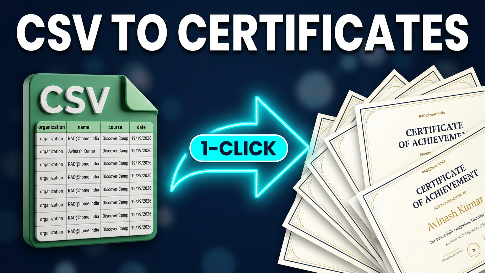

# Certificate Generator

**Turn a CSV into hundreds of certificates — PNG and PDF — without uploading anything.**

[**▶ Open the app**](https://avikhagol.github.io/certificate-generator/) · [Watch the demo](https://www.youtube.com/watch?v=e_CAPwU1Hbw) · MIT licensed

[](https://www.youtube.com/watch?v=e_CAPwU1Hbw)

A fully static, browser-based certificate generator. Upload recipient data, customize text and picture layers on a live certificate canvas, and export individual PNG/PDF files or a ZIP containing the full batch.

## Why this one

| | |
| --- | --- |
| **Zero dependencies** | No npm packages, no CDN scripts, no frameworks. The ZIP writer and the PDF writer are hand-written in plain JavaScript. |
| **Zero build step** | What you see in `dist/` is what ships. Clone it, open `index.html`, done. |
| **Under 100 KB of code** | The whole editor is one HTML file, one stylesheet and a handful of small scripts. |
| **No backend, no signup, no upload** | Recipient data, background artwork and font files never leave your browser. There is no server to send them to. |
| **Works offline** | Once the page has loaded it needs no network. Run it from a USB stick on an air-gapped machine. |
| **Agent-ready** | Registers [WebMCP](https://github.com/webmachinelearning/webmcp) tools, so an AI browser agent can drive the editor and generate a batch for you. |
| **MIT licensed** | Fork it, rebrand it, host it for your own institution. |

Check the claims yourself: there is no `package.json` anywhere in this repository, and `dist/index.html` loads nothing but its own relative `assets/`.

If Certificate Generator is useful to you, [star the repository](https://github.com/avikhagol/certificate-generator) to follow updates and support the project.

## Demo

<p align="center">
  <a href="https://www.youtube.com/watch?v=e_CAPwU1Hbw">
    
  </a>
</p>

GitHub strips `<iframe>` from READMEs, so the image above links to the video. The app page itself has a click-to-play embed.

## Features

- CSV files with any header names; headers become placeholders such as `{{name}}`
- TXT files with one recipient name per line
- PNG, JPEG, or WebP backgrounds that set the certificate's native dimensions
- Multiple independently movable, resizable, replaceable, and croppable picture layers
- Per-recipient photo layers matched by filename from a local folder
- Fixed text and variable placeholder fields
- Local custom font uploads (`.ttf`, `.otf`, `.woff`, and `.woff2`)
- Drag, resize, rotate, nudge, style, align, add, and delete text and picture layers
- Live preview for every record
- Selectable Normal, High, and XHigh PNG and landscape A4 PDF export quality
- Batch ZIP with high-resolution PNG and PDF folders
- Save and load complete projects as a single self-contained `.certproj.json` file
- Automatic IndexedDB autosave with a dismissible restore prompt on the next visit
- Blank canvas mode for designing from scratch
- Responsive interface with sample data and a built-in template

## Data format

CSV example:

```csv
name,course,date,organization
Avinash Kumar,Discover Camp,19 September 2026,RAD@home India
Lorem Ipsum,Discover Camp,19 September 2026,RAD@home India
```

Each header is available as a placeholder. For example, `{{course}}` resolves to the course value for the selected recipient.

For a simple list, use a `.txt` file with one name per line. This creates a single `{{name}}` placeholder.

## Custom fonts

Select a text layer, then choose **+ Custom** beside the Font menu. Uploaded TTF, OTF, WOFF, and WOFF2 files are loaded only in the current browser session and are immediately available in the live preview and every export. Font files are never uploaded to a server.

Custom fonts are restored automatically when you load a saved project or accept an autosave restore point, because the font file itself is stored inside the project. Fonts uploaded in a session that was never saved must be reselected after reloading the page. Ensure that the font's license permits use in generated certificates.

## Saving and loading projects

Use **Save project** in the top toolbar to download the whole design as a single self-contained `*.certproj.json` file: all text layers, picture layers, photo layer bindings, their rotation angles, the background image and its crop, canvas dimensions, recipient records, export quality, and every uploaded font file. Recipient photos are the one exception — see [Recipient photos](#recipient-photos). Images and fonts are embedded as base64, so the file needs no companion assets and can be emailed, archived, or shared.

Use **Load project** to reopen such a file. Images are rebuilt and custom fonts are re-registered, so the live preview and every export match what was saved. Files that are not valid projects, or that were written by a newer schema version, are rejected with an explanatory message and leave the current design untouched.

Project files carry a `schema` identifier and an integer `version`. The current version is **1**.

Because backgrounds are embedded at full resolution, project files can reach several megabytes; the app warns you when a save exceeds roughly 12 MB but never truncates anything.

### Autosave and restore

The working design is autosaved to IndexedDB in this browser every few seconds and when the tab is hidden or closed, so an accidental tab close does not lose the work. On the next visit a dismissible banner offers to **Restore** it — nothing is ever overwritten silently. **Not now** keeps the restore point for later and **Discard** deletes it. `localStorage` is not used because embedded images exceed its quota. If IndexedDB is unavailable (private browsing, blocked storage, or an exhausted quota) autosave is skipped silently and every other feature keeps working.

## Backgrounds and picture layers

Uploading a background changes the certificate canvas to the image's exact pixel dimensions. Use **Crop background** to choose only the area you need; the certificate then adopts the cropped image's exact dimensions and aspect ratio. Existing text and picture positions are scaled proportionally so the layout stays aligned.

Use **Add picture** to place logos, signatures, portraits, seals, or other artwork above the background. You can add multiple pictures, then crop, move, resize, adjust opacity, replace, or delete each layer independently. The crop editor supports freeform, square, 4:3, 16:9, and current-certificate aspect ratios. Picture layers are included in PNG, PDF, and ZIP exports and never leave the browser.

## Recipient photos

A photo layer shows a **different image for every row of your CSV** — headshots, signatures, team logos. Add one with **+ Photo**, point it at the CSV column holding the filenames, and link the folder those files live in.

### Why a folder, not a path

A browser cannot open a path. If your CSV says `C:\photos\ada.jpg`, no web page is allowed to read that file — it is a hard security boundary, not a missing feature. So the column is treated as a **lookup key** rather than a path: you hand the app a folder with **Link photo folder**, and it matches your CSV values against the files you picked. Nothing is uploaded and nothing leaves the device, exactly as with backgrounds and fonts.

Matching is forgiving. It tries the exact value first, then the filename on its own, then the filename without its extension, and finally a loose comparison that ignores case, accents, spaces, hyphens and underscores. All of these find the same file:

| CSV value | Matches |
| --- | --- |
| `ada.jpg` | `ada.jpg` |
| `C:\Users\avi\photos\ada.jpg` | `ada.jpg` |
| `ADA.JPG` | `ada.jpg` |
| `ada` | `ada.jpg` |
| `jose nunez` | `josé-núñez.png` |

If a CSV column contains values that all end in `.png`, `.jpg` or `.webp`, the app notices after an upload and suggests adding a photo layer.

### Fit, shape and gaps

Recipient photos arrive in every aspect ratio, so each layer has a **fit** rather than a fixed crop: **Cover** fills the box and crops the overflow (the right default for portraits), **Contain** fits the whole image inside, and **Fill** stretches it. Layers can be rectangular or circular, and they move, resize, rotate and take opacity like any other layer.

When a row has no matching file the layer is left empty, or draws a dashed placeholder box if you prefer — your choice per layer. The **Match report** lists exactly which rows are unmatched, and a batch export that would leave gaps stops and shows you that report first, so you find out before you send five hundred certificates rather than after.

### What is and is not saved

Photo layers are saved into `.certproj.json` as a **binding** — the column name, geometry, fit and shape — never the photos themselves. Embedding hundreds of recipient images would push a project past the autosave limits, and the files are yours to keep. After opening a saved project, link the photo folder again and every layer resolves.

Photos are decoded once and downscaled to the largest size the layer actually needs, and only a small number are held in memory at a time, so a large batch does not exhaust it.

## Blank canvas

**Blank template** clears every text, picture and photo layer and leaves a plain white canvas at the current dimensions, for designing something from scratch rather than editing the built-in sample. **Use sample template** brings the decorated 1200 × 848 template back, and **Reset** restores the whole sample certificate.

## Rotation

Every text and picture layer carries its own rotation angle. Select a layer and either drag the round handle that appears above it or type an angle into the **Rotation** field in the sidebar. Hold **Shift** while dragging to snap to 15° steps. Angles are stored in degrees and folded into the range −180° to 180°, so 200° and −160° are the same value.

A layer turns around the centre of its own box: for a picture that is the centre of the image, and for a text layer it is the horizontal centre of the field and the vertical middle of the wrapped text block. The preview and the exported PNG, PDF, and ZIP use exactly the same pivot, so what you see on screen is what is rendered.

Two consequences are worth knowing. Because a text layer's pivot depends on how many lines the text wraps to, a rotated field whose text wraps to a different number of lines for a different recipient will pivot around a correspondingly different point — the block stays centred on itself in each case. And because X, Y, and Width still describe the *unrotated* box, a rotated layer can extend past the canvas edge; it is clipped identically in the preview and in exports.

Rotation is stored in `.certproj.json` files. Project files written before this feature load fine and their layers simply start at 0°.

## Export quality

Choose a quality preset in the top toolbar before downloading:

| Preset | Render scale | Best for |
| --- | --- | --- |
| Normal | Original background dimensions | Quick drafts and screen sharing |
| High | 2× background dimensions | Everyday digital use and smaller prints |
| XHigh | 3× background dimensions | Professional printing |

Higher settings create larger files and use more browser memory. The selected preset applies to PNG, PDF, and batch ZIP exports.

## Run locally

Serve the `dist` folder with any static file server. For example:

```bash
python3 -m http.server 4173 --directory dist
```

Then open `http://localhost:4173`.

Opening `dist/index.html` directly also works in modern browsers, but a local server is recommended for consistent behavior.

## Deploy to GitHub Pages

The included workflow deploys `dist/` whenever the `main` branch is pushed.

1. Push this repository to GitHub with `main` as the default branch.
2. Open **Settings → Pages** in the GitHub repository.
3. Under **Build and deployment**, choose **GitHub Actions** as the source.
4. Open the **Actions** tab and wait for **Deploy to GitHub Pages** to finish.

The site will be available at `https://<account>.github.io/<repository>/`. All asset paths are relative, so project Pages URLs work without changes.

You can also run the workflow manually from the Actions tab.

## Project structure

```text
dist/
  index.html
  assets/
    app.js
    project-io.js
    styles.css
    social-preview.png
.github/workflows/deploy-pages.yml
LICENSE
README.md
```

## Browser support

Use a current version of Chrome, Edge, Firefox, or Safari. Large batches are generated in memory; for hundreds of high-resolution certificates, split the input into smaller files if the browser becomes memory-constrained.

For best printed results, start with a high-resolution background. Higher export scales make text and picture layers sharper, but cannot restore detail missing from a low-resolution background image.

## License

[MIT](LICENSE) © Avinash Kumar
